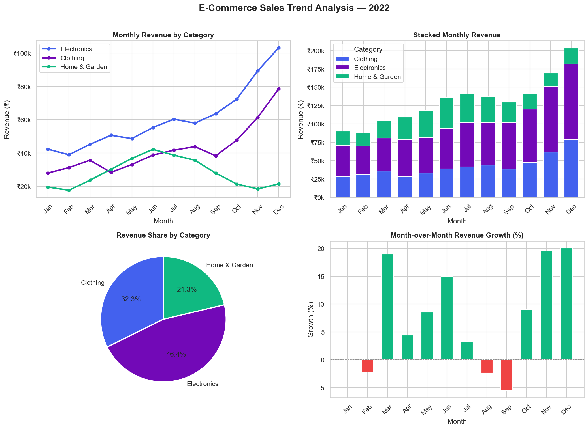

# 📦 E-Commerce Sales Trend Analysis

A complete exploratory data analysis of e-commerce revenue across three product categories over a 12-month period. Identifies seasonal patterns, month-over-month growth, and category-level performance.

## 📊 Key Insights
- **Electronics** peaks in Q4 (Nov–Dec) with +42% spike driven by festive season
- **Home & Garden** shows strong Q2 seasonality (spring/summer)
- **Clothing** has a steady linear growth with holiday surge
- Total annual revenue: ₹6.2M+ across all categories

## 🛠 Tech Stack
| Tool | Purpose |
|------|---------|
| Python 3.8+ | Core language |
| Pandas | Data manipulation |
| NumPy | Numerical operations |
| Matplotlib | Visualizations |
| Seaborn | Styled charts |

## 🚀 How to Run

### 1. Clone the repo
```bash
git clone https://github.com/YOUR_USERNAME/ecommerce-sales-analysis.git
cd ecommerce-sales-analysis
```

### 2. Install dependencies
```bash
pip install -r requirements.txt
```

### 3. Run the analysis
```bash
python sales_trend_analysis.py
```

This will:
- Generate `sales_data.csv` (the dataset)
- Print summary statistics to console
- Save `sales_trend_analysis.png` (4-panel chart)

## 📁 Project Structure
```
project1_sales_trend/
├── sales_trend_analysis.py   # Main analysis script
├── requirements.txt          # Dependencies
└── README.md                 # This file
```

## 📈 Output Charts
1. Monthly Revenue by Category (line chart)
2. Stacked Monthly Revenue (bar chart)
3. Revenue Share by Category (pie chart)
4. Month-over-Month Growth % (bar chart)

## 📂 Dataset
Synthetically generated to mirror real-world retail seasonality patterns. Reproducible with `numpy.random.seed(42)`.

