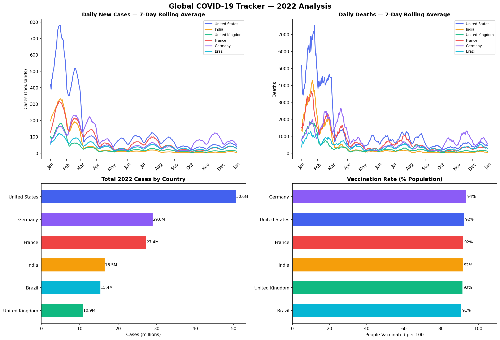

# 🌍 Global COVID-19 Data Tracker

End-to-end data pipeline and visualization dashboard tracking COVID-19 cases, deaths, and vaccination rates across 6 major countries throughout 2022. Uses Our World in Data (OWID) public dataset.

## 📊 Key Insights
- USA had the highest absolute case count in 2022 (Omicron wave: Jan peak)
- India's 3rd wave resolved quickly with high vaccination rollout
- Germany experienced a late-year autumn surge (Oct–Nov)
- All 6 nations crossed 60%+ vaccination coverage by mid-2022

## 🛠 Tech Stack
| Tool | Purpose |
|------|---------|
| Python 3.8+ | Core language |
| Pandas | Data processing, rolling averages |
| Matplotlib | Time-series visualizations |
| Requests | Auto-download OWID dataset |

## 🚀 How to Run

```bash
pip install -r requirements.txt
python covid_tracker.py
```

**Online mode:** Script downloads the latest OWID dataset automatically (~20MB).  
**Offline mode:** Script uses built-in representative 2022 data — no internet needed.

## 📁 Project Structure
```
project3_covid_tracker/
├── covid_tracker.py         # Main analysis script
├── requirements.txt
└── README.md
```

## 🗃 Data Source
- **Our World in Data COVID Dataset**
- URL: https://covid.ourworldindata.org/data/owid-covid-data.csv
- Updated daily, 220,000+ rows, 67 columns
- License: CC BY 4.0 (free to use with attribution)

## 📈 Output Charts
1. Daily new cases — 7-day rolling average (6 countries)
2. Daily deaths — 7-day rolling average
3. Total 2022 cases comparison (horizontal bar)
4. Vaccination rate per 100 population

